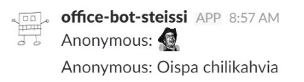
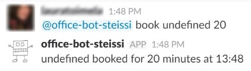
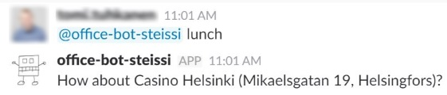

Slack Bot
------------------------------

Slack bot for office use.

 * Send a message anonymously
 * Is there anyone at the office
 * Office temperature
 * List free meeting rooms
 * List next meeting room reservations
 * Book a meeting room
 * Cancel a booking made with the SlackBot
 * Suggest a lunch place
 * Suggest a beer place
 * Send email to defined address

## Get Started

1) Create new configuration file (_src/configuration.js_)
 * Copy template from configuration file [section](https://github.com/ttu/office-slack-bot#configuration-file)
1) Create new App for Slack
 * Add it to `botToken`
1) Run bot e.g. with [forever](https://github.com/foreverjs/forever), supervisord etc.
 * `$ forever start src/app.js`

## Functionality

Bot sends a reply to the channel or to private chat where the command was sent from.

Sends exceptions and errors to the user defined in the configuration file (`slackAdminUserId`).

#### Anonymous message

Anonyous messages are sent to the home channel defined in the configuration file (`homeChannelId`)



#### Anyone at the office

Returns _Office has people_ or _Office is empty_ message, depending if there is currently people at the office.

`GET /api/haspeople/{id}` from [Sensordata API](https://github.com/ttu/sensordata-node-restapi) for all sensors in the configuration file. If any of the requests return true, then there is someone at the office.

#### Get Temperture

Returns lates sensors data for all sensors defined in the configuration file.

`GET /api/data/{id}` from [Sensordata API](https://github.com/ttu/sensordata-node-restapi).

```
{"name":"5krs","temperature":21.25,"humidity":23,"noise":47,"light":124,"time":"11:47 19.01."}
{"name":"6krs","temperature":22.64,"humidity":23,"noise":45,"light":571,"time":"11:47 19.01."}
``` 

#### Free meeting rooms, current events & book a room

Free meeting rooms shows a list of rooms that are free and duration how long they are available. Current events shows a list of next 2 events for each calendar defined in the configuration file. Book a room makes a reservation for the next X minutes if that time is available. Bookings made with the SlackBot can also be cancelled by the same user.



Uses [Google Calendar API](https://developers.google.com/google-apps/calendar/v3/reference/). Meeting room calendars are defined in the configuration file. Booker info from [Slack User Info](https://api.slack.com/methods/users.info).

Requirements:
* Execute Step 1: Turn on the Google Calendar API from [quicksart](https://developers.google.com/google-apps/calendar/quickstart/nodejs). Save file as client_secret.json
* Execute `npm run create_token` to store authentication token to json-file. This file is not in version control
* Both files need to be in the workspace root

#### Suggest a lunch or a beer place 

Get list of restaurants/bars from [Google Places API](https://developers.google.com/places/web-service/search) that are max 500m/800m from the office and return random item from that list. Office location is defined in the configuration file. 



Requirements:
* [Get an API key](https://developers.google.com/places/web-service/get-api-key)

#### Send email

[Nodemailer](https://nodemailer.com/) is used to sen email. Add `mailConfig` to the configuration file. Will send email to defined email address and cc to sender. Add information to the configuration's `emailMessage`.

Bot has an implementation to send an email to the maintenane company.

Requirements:
* If using google account, enable less secure apps https://myaccount.google.com/lesssecureapps

## Files

* src/app.js
 * Slack Botkit related communication
* src/consoleApp.js
 * Console application for testig
* src/bot.js
 * Logic for executing correct functionality
* src/configuration.js
 * __Required__ configuration for the application. Not in version control.
 * Google Calendar integration
* src/emailSender.js
 * Email sending functionality
* src/googlePlacesService.js
 * Google Places API integration

## ConsoleApp for testing

Console app wraps the same functionality as BotKit, so it works with same commands and returns same responsens.

```sh
$ npm run console
```

## Configuration file

configuration.js containts tokens, passwords, locations, sensors etc. Some of these can be given also as environment variables

If `allowGuestsToUse` is set to _false_, then restricted users will get an error messages when trying to send messages to the bot. 

configuration.js:
```js
'use strict';

module.exports = {
    botToken: 'xxxx',
    homeChannelId: 'xxxx',
    slackAdminUserId: 'xxxx',
    allowGuestsToUse: false,
    apiUserName: 'xxxx',
    apiPassword: 'xxxx',
    apiUrl: 'xxxx',
    locationApiKey: 'xxxx',
    office: { lat: 60.17, lon: 24.94 },
    sensors: [ 
        { id: 'xxx', name: 'xx'},
        { id: 'xxx', name: 'xx'}        
    ],
    meetingRooms: [
        { name: 'xxxx', id: 'xxxx'}
    ],
    emailConfig: {
        service: "gmail",
        host: "smtp.gmail.com",
        auth: {
            user: "xxx@gmail.com",
            pass: "xxxxx"
        }
    },
    emailMessage: {
        receiver: 'test@test.com',
        subject: 'Maintenance request',
        template: `
Hi,

{content}

Br,
{senderName}
`
    }
};
```

## Tests

Test folder contains tests. Some tests require correct Google API keys in the configuration file.

```sh
$ npm test
```

Run test matchin the pattern:

```sh
$ npm run test:g [pattern]
```

## Contributing

Pull requests are welcome. For major changes, please open an issue first to discuss what you would like to change.

## License

Licensed under the [MIT](LICENSE) License.